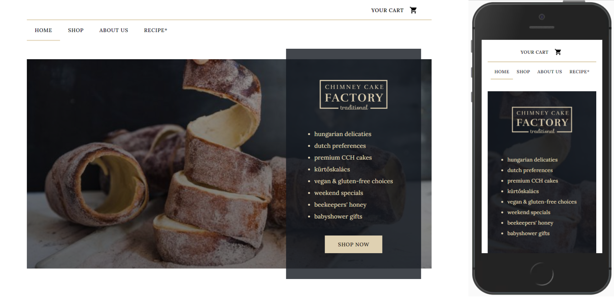

## Deployed on Netlify

The live version is available by clicking [here](https://chimney-cake-factory.netlify.app/) or going to https://chimney-cake-factory.netlify.app/

## Running this project locally

1. Clone this repository and open it in your Code Editor of choice.

2. Open the terminal in your Code Editor.

3. Install the packages required to run the project by running either:

```bash
npm install
## or
yarn install
```

4. After installation run the development server with either of the following commands:

```bash
npm start
## or
yarn start
```

5. The command automatically opens a browser on [http://localhost:3000](http://localhost:3000).

6. You can start editing the page by modifying `src/App.js`. The page auto-updates as you edit the file.

## Completing a test purchase

If you would like to go through the shopping process from start to finish do the following:

1. Add items to your shopping cart by clicking on the "Add to cart" button under products of your choice on the /shop page.

2. Click on the "Your cart" button on the top or go to /cart and click "Checkout".

3. Fill out the shipment form and click "Next".[1]

4. At the payment form type

`4242 4242 4242 4242 04/24 242`

( 42 through) to the place of the credit card and click on the pay button.

5. Check the inbox of the email you filled in before to see your order confirmation and the reciet.

[1]: If you don't feel comfortable sharing your email address, I recommend [this (https://temp-mail.org/en/)](https://temp-mail.org/en/) service to create a dummy email inbox for testing.

## The goal of the project

Create an E-Commerce shopping experience for a bakery called Chimneycake Factory using React.js, Commerce.js and Stripe.js.

This website is a Single Page Application (SPA) built using `create-react-app` that works together with the Commerce.js API on the client side to create a start-to-finish webshop experience by making API calls to the headless backend service.

## Preview



## Achievements

The website allows you to:

- list all products available for purchase
- render products based on product categories
- go to a product detail page by clicking on an item listed
- see the related items on the product details page
- add products to the shopping cart by clicking on the "Add to cart" button under each item card
- access your shopping cart by clicking on the 'Your cart" button on the top left or going to /cart
- remove, add items to or empty your shopping cart on the /cart
- complete the shopping process by clicking on the "Checkout" button on the /cart page
- fill in the personal and shipment information and submit a payment in a 2-step checkout form
- pick from different shipping options available in the shipping subdivision provided
- recheck the order before finishing the checkout process
- submit a payment using Stripe
- recieve the order information and the reciet via the email address provided
- get an overview about the company on the /about page
- learn how to make your own chimney cake at home on the /recipe page

## Technologies used to create the project

- The website is created using `create-react-app`
- The products, the cart and the checkout functionality are connected to the [Commerce.js headless backend and API](https://commercejs.com/)
- The website is styled using a costum template using the [Material-UI React Component Library](https://material-ui.com/)
- The website uses the [React Stripe.js and Stripe components and elements](https://stripe.com/docs/stripe-js/react) to accept payments

## Documentation used to create the project

- [Material-UI documentation](https://material-ui.com/customization/theming/)
- [Commerce.js with React.js documentation](https://commercejs.com/docs/guides/products-react#that-wraps-it-up)
